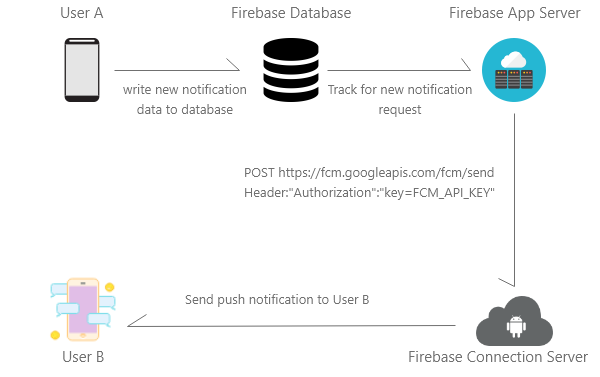
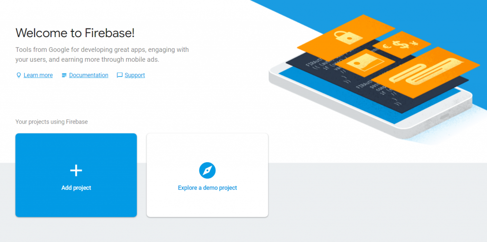
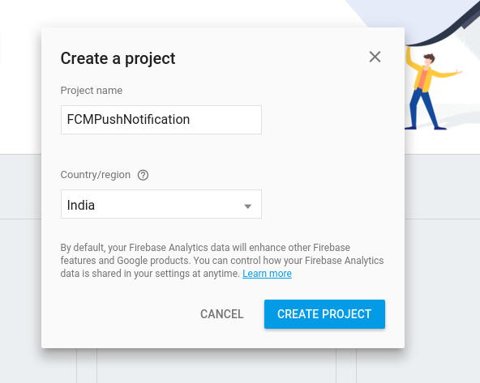
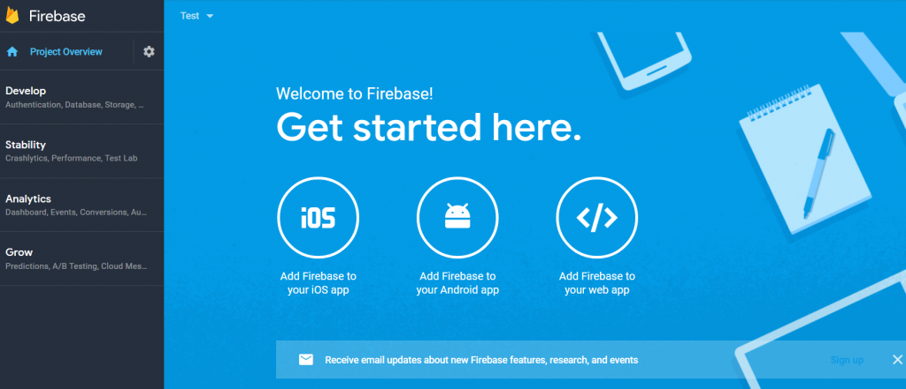
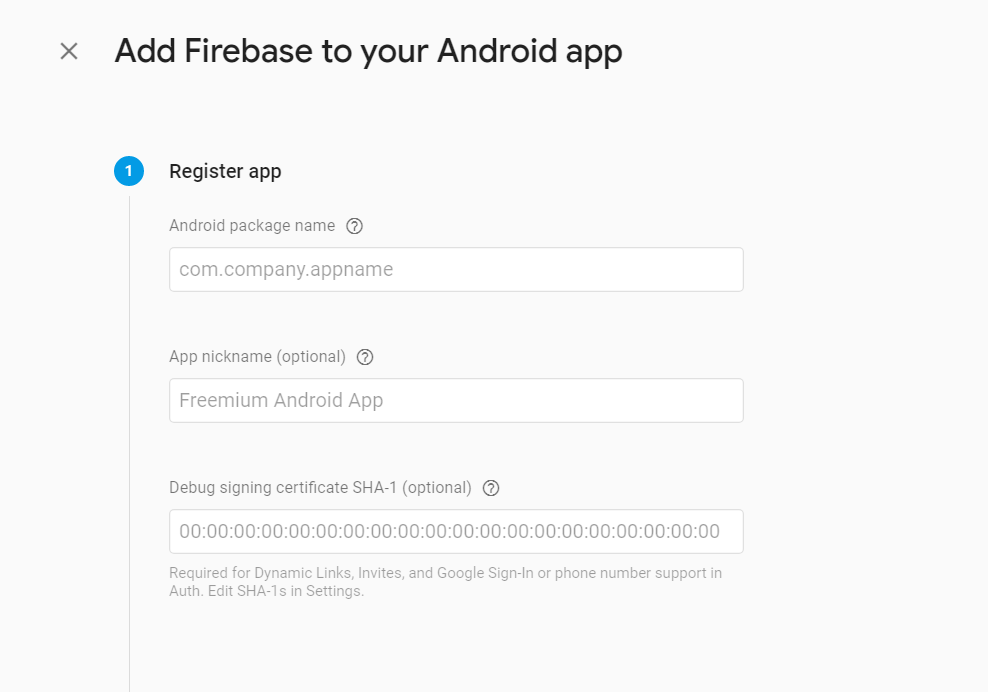
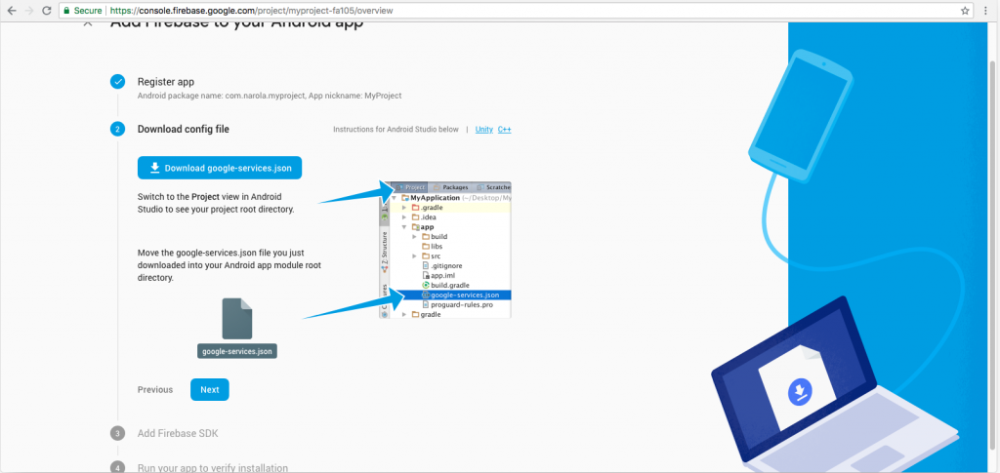
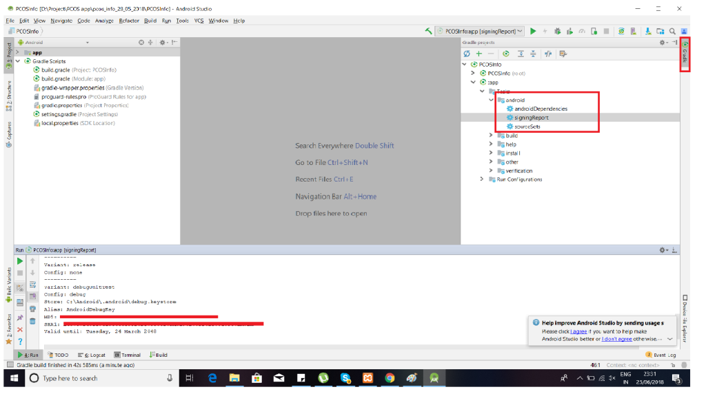

Firebase Push Notification Tutorial

<h2 style="text-align: left;"><strong>How Firebase Push Notification works?</strong></h2>

Firebase serves as a module between your server and the devices that will be receiving the push notifications that you create. Your server informs Firebase that a notification has to be sent. Then Firebase does the work behind the scenes to get the notification published.

&nbsp;

<h2 style="text-align: left;"><strong>How to integrate FCM into Android Project?</strong></h2>

Step for creating  Firebase Project

<strong><em>Step 1:</em></strong> Open Firebase <a href="https://console.firebase.google.com/u/2/?pli=1">console</a>

<em><strong>Step 2: </strong></em>Click on Add project and give name to your project and select country. If you have already created a project skip this step.

 

<em><strong>Step 3: </strong></em>Then select “Add Firebase to your Android app”.

 

<em><strong>Step 4: </strong></em>Add project package id or application id and genrate SHA-1 signatature of your machine.

 

<em><strong>Step 5: </strong></em>Download google-service.json and put into app module.

 

<h2><strong>How to generate SHA Key using Android Studio:</strong></h2>
<ol>
<li>Open your project into Android studio.</li>
<li>Click on Gradle tab on right side.</li>
<li>Collapse :app module -&gt; Tasks -&gt; Android -&gt; signing report.</li>
<li>SHA-1 will generate. Copy and paste into SHA-1 in firebase console.</li>
</ol>

<h2><strong>How to integrate Firebase SDK into Android Project?</strong></h2>

<em><strong>Step 1:</strong></em>

Add below code into &lt;project&gt;/build.gradle file.

<pre class="line-numbers" data-start="1"><code class="language-markup">buildscript {
  dependencies {
    // Add this line
    classpath 'com.google.gms:google-services:4.3.2'
  }
}</code></pre>

<em><strong>Step 2:</strong></em>

Add below code into &lt;project&gt; / &lt;app&gt;/build.gradle. 

<pre class="line-numbers" data-start="1"><code class="language-kotlin">dependencies {
  // Add this line
  implementation 'com.google.firebase:firebase-messaging:20.0.0'
}
...
// Add to the bottom of the file
apply plugin: 'com.google.gms.google-services'</code></pre>

<em><strong>Step 3:</strong></em>

Press on sync now in the Android Studio.

<h2><strong>Now you can send Push Notification using Firebase Console</strong></h2>

  1. Go to firebase console and select the app you created.
  2. From the left menu select notification.
  3. Click on new message.
  4. Enter message, select single device and paste the token you copied and click on send. The same as I did on the video, and check your device
  
So that's all for this Firebase Cloud Messaging Tutorial. If any query/suggestion for Firebase Cloud Messaging Tutorial ask freely on
hardikdungrani8@gmail.com

Thanks.
